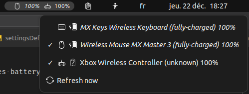
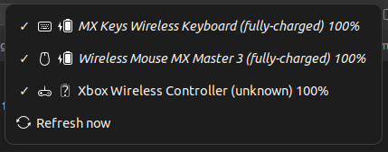
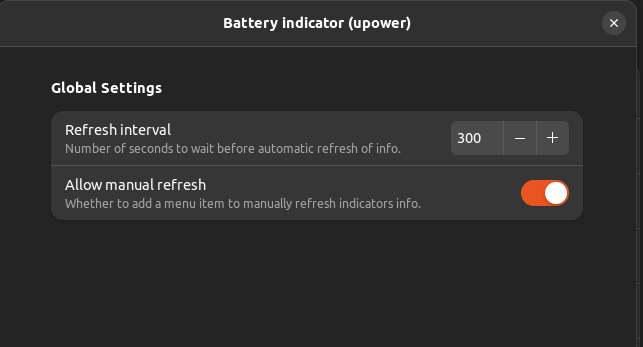

# Battery-indicator (upower)
This is a gnome-shell extension to display your connected devices battery informations as reported by upower in the status panel.

Clicking on the indicators will reveal a menu which will let you display more informations about connected devices:
* icon identifier
* icon of battery state as reported by upower
* device model
* (state of the battery)
* battery level percentage

Good to know:
upower is not always reliable on reporting battery level for connected devices. Generally it will tell you that you should ignore the reported battery level. In such cases this extensions will write the percentage level indicato in italic. Same representation will be used for corresponding popup menu entry.

# Settings
You can via the extension prefs set the refresh interval and whether to add a manual refresh button or not. By default the refresh interval is 5 minutes.

Also you can decide to show/hide devices from the panel indicator by clicking them in the indicator menu. item with now check mark in front of it are marked as hidden.

Other settings are self explanatory

# Screenshots

## status indicators and menu

## status indicators

## indicator popup menu

## settings

